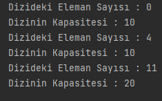
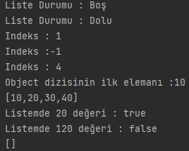

## Kendi Liste Sınıfımızı Yazmak
Java'da generic yapısını kullanarak verileri tuttuğumuz bir sınıf tasarlıyoruz.

Sınıfın amacı içerisinde dinamik bir Array (Dizi) tutması ve veri tipini dinamik olarak alması. Bunun için generic bir sınıf oluşturulması gerekli.

#### **NOT : COLLECTION SINIFI KULLANILMAYACAKTIR ! KENDİ LİSTE SINIFIMIZI OLUŞTURMALIYIZ.**

Sınıf özellikleri :

* Sınıf içerisindeki dizinin varsayılan boyutu 10 ve dizinin eleman sayısı ihtiyaç duydukça 2 katı şeklinde artmalı.
* Sınıfa ait iki tür constructor metot bulunmal 
    * MyList() : Boş contructor kullanılırsa dizinin başlangıç boyutu 10 olmalıdır.
    * MyList(int capacity) : Dizinin başlangıç değeri capacity parametresinden alınmalıdır.
* size() : dizideki eleman sayısını verir.
* getCapacity() : dizinin kapasite değerini verir.
* add(T data) : sınıfa ait diziye eleman eklemek için kullanılmalıdır. Eğer dizide yeteri kadar yer yok ise, dizi boyutu 2 katına çıkartılmalıdır.

### Program Çıktısı

* get(int index): verilen indisteki değeri döndürür. Geçersiz indis girilerse null döndürür.
* remove(int index): verilen indisteki veriyi silmeli ve silinen indis sonrasında ki verileri sol doğru kaydırmalı. Geçersiz indis girilerse null döndürür.
* set(int index, T data) : verilen indisteki veriyi yenisi ile değiştirme işlemini yapmalıdır. Geçersiz indis girilerse null döndürür.
* String toString() : Sınıfa ait dizideki elemanları listeleyen bir metot.

### Program Çıktısı

* int indexOf(T data) : Parametrede verilen nesnenin listedeki indeksini verir. Nesne listede yoksa -1 değerini verir.
* int lastIndexOf(T data) : Belirtilen öğenin listedeki son indeksini söyler. Nesne listede yoksa -1 değerini verir.
* boolean isEmpty() : Listenin boş olup olmadığını söyler.
* T[] toArray() : Listedeki öğeleri, aynı sırayla bir array haline getirir.
* clear() : Listedeki bütün öğeleri siler, boş liste haline getirir.
* MyList<T> sublist(int start,int finish) : Parametrede verilen indeks aralığına ait bir liste döner.
* boolean contains(T data) : Parametrede verilen değerin dizide olup olmadığını söyler.

### Program Çıktısı
